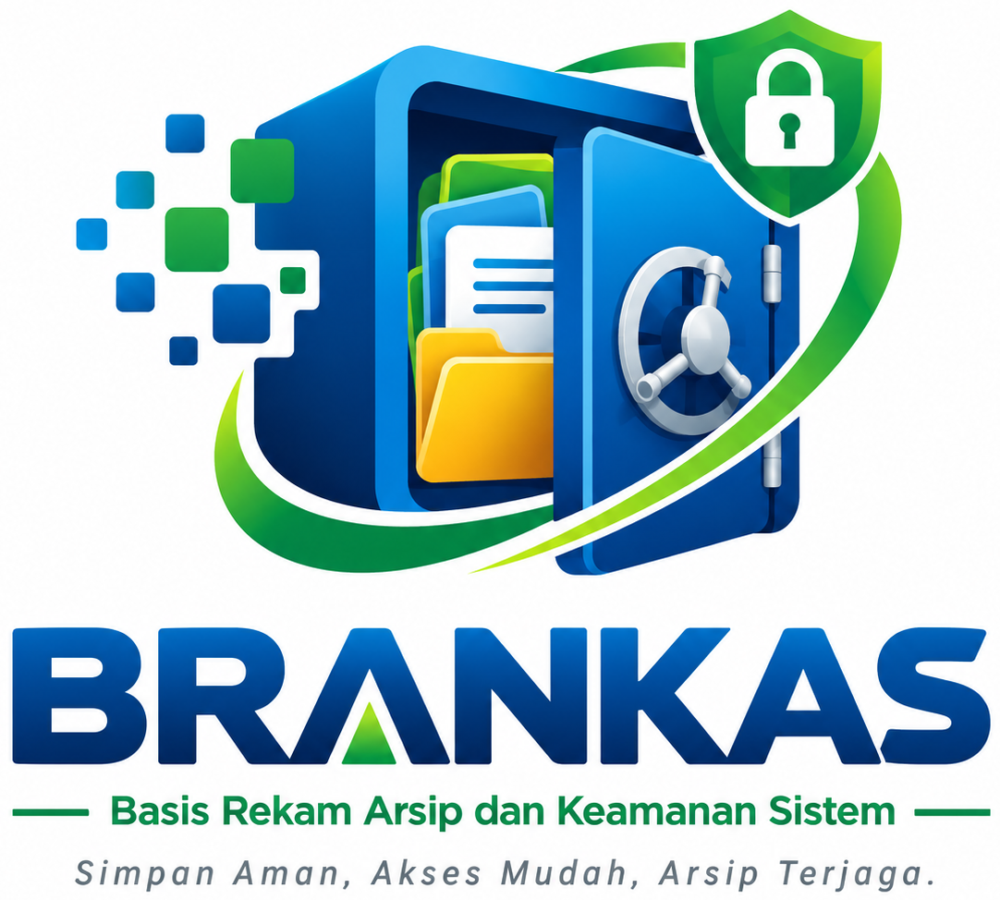

# BRANGKAS DIGITAL LP MA'ARIF NU PBNU

<p align="center">
  
</p>

<p align="center">
  <strong>Sistem Manajemen Arsip Dokumen Berharga, Aset Lembaga, & Rekapitulasi Serah Terima (Handover)</strong><br>
  <em>Lembaga Pendidikan Ma'arif Nahdlatul Ulama Pengurus Besar Nahdlatul Ulama (LP Ma'arif NU PBNU)</em>
</p>

<p align="center">
  
  
  
  
  
  
</p>

---

## 📋 Tentang Aplikasi

**Brangkas Digital LP Ma'arif NU PBNU** adalah platform digital berbasis web yang dirancang untuk mengamankan, mendokumentasikan, menginventarisasi, dan melacak peredaran surat-surat berharga serta aset fisik milik LP Ma'arif NU PBNU. 

Sistem ini memastikan seluruh dokumen kepemilikan aset (seperti Sertifikat Tanah dan Akta Notaris), inventaris barang lembaga, serta riwayat peminjaman/pengagunan/hibah tercatat secara real-time, akuntabel, dan transparan.

---

## ✨ Fitur Utama Sistem

### 1. 🔄 **Record of Transfer (Serah Terima Dokumen & Aset)**
- **Pencatatan Alur Distribusi**: Mendata transaksi dokumen atau aset yang **Dipinjam**, **Diagunkan ke Bank**, **Dihibahkan**, atau **Dikembalikan**.
- **Validasi Cerdas Anti-Ganda**: Dokumen yang sedang berstatus *Dipinjam* atau *Diagunkan* tidak dapat dipinjam kembali sebelum ada transaksi *Pengembalian*.
- **Alur Pengembalian Cepat**: Otomatis memfilter hanya dokumen yang sedang dipinjam/diagunkan untuk diproses kembali ke status *Tersedia*.
- **Pencarian Live Select2**: Dropdown dokumen dilengkapi kolom ketik langsung untuk mencari item dengan cepat di antara ratusan berkas.
- **Filter & Rekapitulasi**: Filter berdasarkan Kategori dan Status, pencarian free-text pihak terkait/bank/catatan, serta paginasi 10 data per halaman.

### 2. 📜 **Arsip Surat Tanah**
- **Pendataan Sertifikat**: Pencatatan jenis sertifikat (SHM, HGB, Hak Pakai, Wakaf, Girik, dll), nomor sertifikat, luas, atas nama, serta lokasi lengkap (Desa, Kecamatan, Kabupaten/Kota, Provinsi).
- **Status & Indikator Visual**: Sinkronisasi status kepemilikan (*Tersedia, Dipinjam, Diagunkan, Dihibahkan, Dikembalikan, Rusak*) dengan penanda warna status.
- **Modal Detail & Riwayat Handover**: Menampilkan detail lengkap serta tabel riwayat serah terima berkas dengan sistem **Pagination Riwayat** terintegrasi.
- **Filter & Pencarian**: Filter dropdown jenis sertifikat dan status, pencarian nomor/nama/lokasi, serta paginasi data.

### 3. 🏛️ **Arsip Akta Notaris**
- **Manajemen Akta Hukum**: Pencatatan nomor akta, jenis dokumen, nama notaris, kontak/alamat notaris, tanggal akta, dan perihal.
- **Tracking Berkas**: Pelacakan posisi fisik berkas akta notaris (di brankas / sedang dipinjam pihak terkait).
- **Modal Detail & Log Riwayat**: Pratinjau berkas digital dan log perpindahan akta.

### 4. 🏢 **Data Aset Lembaga (Inventaris Fisik)**
- **Kuesioner Inventaris Lengkap**: Pendataan jenis barang (Laptop, PC, Kendaraan, Printer, dll), merek, nomor seri/model, tanggal perolehan, dan sumber perolehan.
- **Nomor Registrasi Otomatis**: Generate kode registrasi aset otomatis bertformat `AST-LPM-YYYYMM-XXXX`.
- **Kondisi & Posisi Aset**: Pemantauan kondisi fisik (*Sangat Baik, Rusak Ringan, Rusak Berat*) dan posisi penempatan (*Ruangan Kantor* atau *Pihak Penerima/Pengguna*).

### 5. 📷 **Multi-Upload Cerdas (Kamera HP, Galeri, & PDF)**
- **Akses Kamera Langsung di HP**: Form input dilengkapi tombol **Buka Kamera HP** (`capture="environment"`) untuk langsung memotret dokumen/aset fisik.
- **Fleksibilitas Format**: Mendukung pemilihan berkas lewat **Galeri Foto** (JPG, JPEG, PNG, WEBP) maupun **Dokumen PDF**.
- **Kapasitas Besar & Preview Real-Time**: Batas ukuran upload hingga **Maksimal 20MB** disertai pratinjau thumbnail instan sebelum data disimpan.
- **Viewer Dokumen Terintegrasi**: Modal preview cerdas otomatis menampilkan foto gambar atau viewer dokumen PDF tanpa error 404.

### 6. 📱 **Mobile Responsive & Sticky Header**
- **Standar Tampilan Ponsel**: Penyesuaian tipografi, padding formulir, dan tabel responsif khusus layar smartphone Android & iOS.
- **Fixed / Sticky Top Header**: Header bar (menu garis tiga dan avatar profil) standby di posisi teratas saat halaman digulir (*scroll*).

### 7. 💰 **Modul Keuangan & Persetujuan**
- **Pengajuan Dana**: Formulir pengajuan dana operasional dengan lampiran bukti dokumen.
- **Alur Verifikasi (Approval)**: Fitur persetujuan/penolakan pengajuan dana oleh role *Aproval* dan *Super Admin*.
- **Rekapitulasi Dokumen**: Buku Bank, Buku Kas Tunai, Buku Kas Umum, Rekening Koran, serta Rekap Bulanan dan Tahunan.

### 8. 🔐 **Manajemen Pengguna & Role-Based Access Control**
Menu manajemen pengguna (**Setting ➔ Users**) eksklusif hanya dapat diakses oleh **Super Admin**:
- **Super Admin**: Akses penuh seluruh modul, manajemen user, approval keuangan, dan aksi hapus data.
- **Admin**: Akses kelola data brankas, input surat tanah, akta notaris, data aset, dan transaksi handover.
- **Aproval**: Hak akses khusus untuk meninjau dan menyetujui pengajuan keuangan.
- **Viewer**: Hak akses read-only (hanya melihat data dan pratinjau dokumen).

---

## 🛠️ Tech Stack

- **Backend Framework**: [Laravel 10.x](https://laravel.com/)
- **Bahasa Pemrograman**: PHP 8.1+
- **Database**: MySQL 8.0+ / MariaDB
- **Frontend & UI**: Bootstrap 5.3, Blade Templating, Custom Mobile CSS
- **Icons**: Tabler Icons (`@tabler/icons`)
- **Plugin JavaScript**: jQuery, Select2 Bootstrap-5 Theme, DataTables

---

## 🚀 Panduan Instalasi Lokal

### 1. Prasyarat Sistem
Pastikan perangkat Anda telah terpasang:
- PHP >= 8.1 dengan ekstensi `pdo_mysql`, `mbstring`, `openssl`, `fileinfo`
- Composer >= 2.x
- Web Server Apache & MySQL (XAMPP / Laragon)

### 2. Kloning Repository
```bash
git clone https://github.com/devmaarifnu/brankas-digital.git
cd brankas-digital
```

### 3. Pasang Dependensi Composer
```bash
composer install
```

### 4. Konfigurasi Lingkungan (`.env`)
Salin file `.env.example` menjadi `.env`:
```bash
cp .env.example .env
```
Sesuaikan konfigurasi database pada file `.env`:
```env
APP_NAME="Brangkas Digital LP Ma'arif NU"
APP_ENV=local
APP_KEY=
APP_DEBUG=true
APP_URL=http://localhost:8000

DB_CONNECTION=mysql
DB_HOST=127.0.0.1
DB_PORT=3306
DB_DATABASE=brangkas_digital
DB_USERNAME=root
DB_PASSWORD=
```

### 5. Generate Application Key & Jalankan Migrasi
```bash
# Buat application key
php artisan key:generate

# Jalankan migrasi database
php artisan migrate

# Hubungkan direktori storage (opsional jika menggunakan storage link)
php artisan storage:link
```

### 6. Jalankan Server Lokal
```bash
php artisan serve
```
Akses aplikasi melalui browser di: `http://127.0.0.1:8000` atau `http://localhost/sipinter-backend/public` (jika menggunakan folder XAMPP).

---

## 📁 Struktur Direktori Utama

```
brankas-digital/
├── app/
│   ├── Http/
│   │   ├── Controllers/
│   │   │   ├── AuthController.php         # Autentikasi login & logout
│   │   │   ├── BrangkasController.php     # Surat Tanah, Akta Notaris, Data Aset
│   │   │   ├── HandoverController.php     # Record of Transfer / Serah Terima
│   │   │   ├── KeuanganController.php     # Modul Keuangan & Pengajuan Dana
│   │   │   └── SettingUserController.php  # Manajemen User (Super Admin)
│   │   └── Middleware/
│   └── Models/                            # Eloquent Models (SuratTanah, AktaNotaris, dll)
├── public/
│   ├── assets/                            # File CSS, JS, font, dan icons
│   │   └── css/custom.css                 # Styling responsif mobile & sticky header
│   └── uploads/                           # Direktori penyimpanan berkas dokumen & foto
│       ├── surat-tanah/
│       ├── akta-notaris/
│       ├── data-aset/
│       └── handover/
├── resources/
│   └── views/
│       ├── auth/login.blade.php           # Halaman login modern
│       ├── brangkas/                      # View Surat Tanah, Akta Notaris, Data Aset
│       ├── handover/index.blade.php       # View Record of Transfer
│       ├── keuangan/                      # View Pengajuan & Rekap Keuangan
│       ├── setting/users.blade.php        # View Manajemen User
│       └── template/                      # Layout utama, header, dan navigasi
└── routes/
    └── web.php                            # Definisi rute aplikasi
```

---

## 📄 Lisensi & Hak Cipta

Dikembangkan untuk dan dikelola oleh:  
**Lembaga Pendidikan Ma'arif NU Pengurus Besar Nahdlatul Ulama (LP Ma'arif NU PBNU)**  
Copyright &copy; 2026 **Brangkas Digital LP Ma'arif NU PBNU** &bull; [brankas.maarifnu.or.id](https://brankas.maarifnu.or.id)

